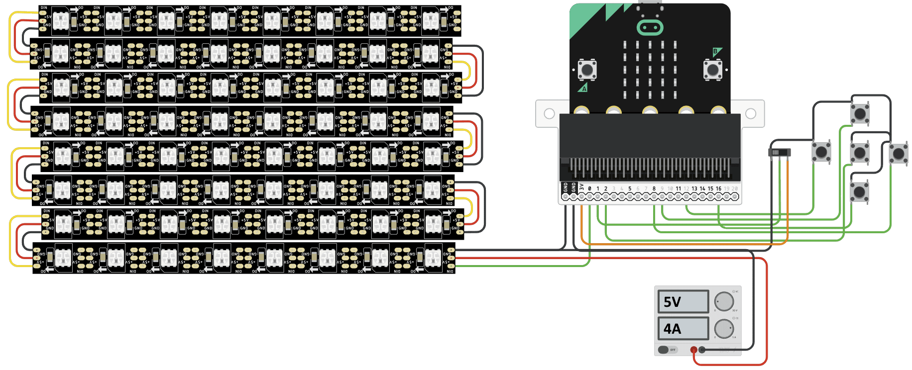

# Build your own Luma Matrix

```admonish warning title="Advanced Knowledge Required"
Building your own Luma Matrix requires some advanced knowledge in electronics and soldering. The guide assumes you have experience with these topics. If you are not familiar with these topics, start with a simpler project to build your skills.
```

The extension allows to render graphics for a 8x8 NeoPixel Matrix using MakeCode. The matrix can be used to display images, text, and control individual pixels. You can build your own Luma Matrix experience using off-the-shelf components according to schematics and parts list below. Alternatively, the design files for the custom PCB are available in [InES-HPMM/LED-Matrix-Workshop](https://github.com/InES-HPMM/LED-Matrix-Workshop) with gerber for PCB order.



## Parts List

| Part | Description | Link |
|-------------|---------------|---------------|
| micro:bit v2 | Microcontroller to be programmed with MakeCode | [micro:bit](https://microbit.org/buy/) |
| 8x8 RGB NeoPixel Matrix | 8x8 grid array of RGB Neopixels. Can be single PCB with pixels or a chained set of strips. | [Adafruit](https://www.adafruit.com/product/1487) |
| 5V Power Supply | Power source capable of delivering 5V / 4A or more | [Adafruit](https://www.adafruit.com/product/1466) |
| DC Barrel Jack to Alligator Clips | Connect power supply to matrix | [Adafruit](https://www.adafruit.com/product/1328) |
| Wires for connection |  Alligator Clips or similar | [Adafruit](https://www.adafruit.com/product/1008) |
| Joystick (optional) | Arcade Joystick, Input device for the micro:bit | [Adafruit](https://www.adafruit.com/product/480) |
| Switch (optional) | SPDT Toggle Switch, Input device for the micro:bit | [Adafruit](https://www.adafruit.com/product/3221) |

## Connection
> **Note:** Do not connect the matrix VCC directly to the micro:bit 3V. The matrix requires more power than the micro:bit can provide.

> **Logic Level:** Neopixels work better with 5V logic. The micro:bit uses 3.3V logic. The matrix will work with 3V level, but adding a [logic level shifter](https://www.instructables.com/A-Quick-Guide-on-Logic-Level-Shifting/) between P0 and LED will improve stability. Consider [this Guide](https://learn.adafruit.com/adafruit-neopixel-uberguide/powering-neopixels) from Adafruit for more detailed information regarding neopixel power and logic level.

1. Flash the micro:bit with the built code using MakeCode
2. Connect Matrix GND to micro:bit GND
3. Connect Matrix GND to GND of external power supply
4. Connect Matrix DIN to micro:bit P0
5. Connect Matrix VCC to VCC of external 5V power supply
6. Connect micro:bit to computer using USB cable

If you want to also use the input methods, connect a switch and a joystick to the micro:bit. The inputs are required for example in snake game
- Switch
    - Connect one side of the switch to micro:bit 3V
    - Connect the other side of the switch to micro:bit GND
    - Connect the middle pin of the switch to micro:bit P1
- Joystick 
    - Center button to P2
    - Up button to P9
    - Down button to P16
    - Right button to P8
    - Left button to P12