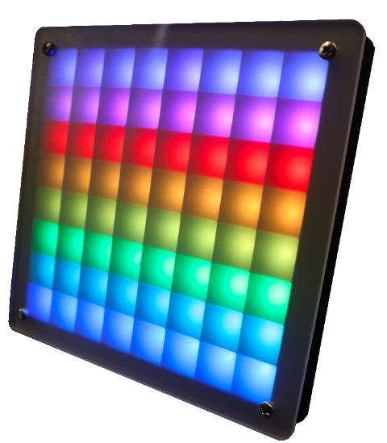
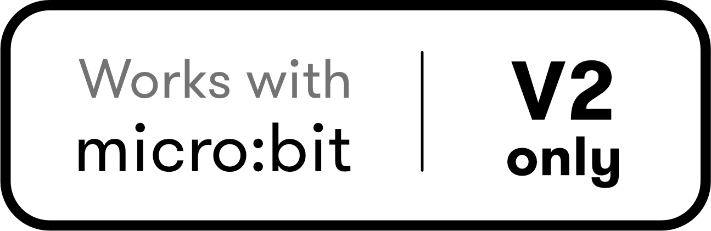

```admonish warning title="Active Development"
This extension is currently under active development. While code is complete, this documentation may be missing some aspects and will evolve over time.
```


# Luma Matrix Workshop

<table cellspacing="0" cellpadding="0" style="border: none;">
    <td style="border: none; text-align: left; width: 70%;">
        The Luma Matrix is a Workshop by ZHAW to play and create with coding. The center of the workshop is an 8 by 8 pixel matrix controlled with a micro:bit. Use the blocks from the extension to build whatever you have in mind. Draw images, show text, display the time, or even connect it to other Luma Matrices.
    </td>
    <td style="border: none; width: 30%; text-align: center;">
        
    </td>
</table>

## Hardware

The extension is built around a custom PCB with an 8x8 LED matrix, paired with a 3d printed frame and a plastic diffuser. The hardware is not available for sale but can be built on your own. Design files are available in [InES-HPMM/LED-Matrix-Workshop](https://github.com/InES-HPMM/LED-Matrix-Workshop) with gerber for PCB order.

If you like to build your own Luma Matrix experience using off-the-shelf components, follow the guide in the [Build your own Luma Matrix](./guides/build-your-own.md) section.

```admonish info title=""
Using these blocks requires the [micro:bit V2](https://makecode.microbit.org/device/v2) hardware. On a micro:bit v1 board, you will see memory errors with **9xx** error code on the screen.

 
```

## Use as extension

This repository can be added as an **extension** in MakeCode.

- Open https://makecode.microbit.org/
- Click on **New Project**
- Click on **Extensions** under the gear menu
- Search for **https://github.com/ines-hpmm/pxt-luma-matrix** and import